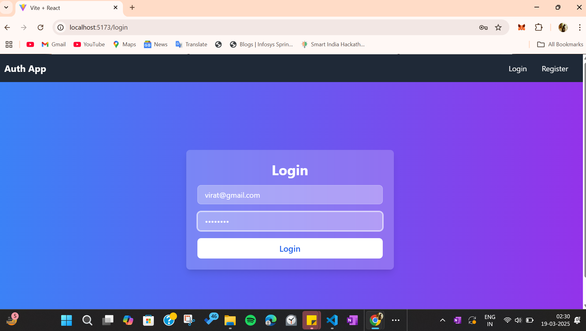
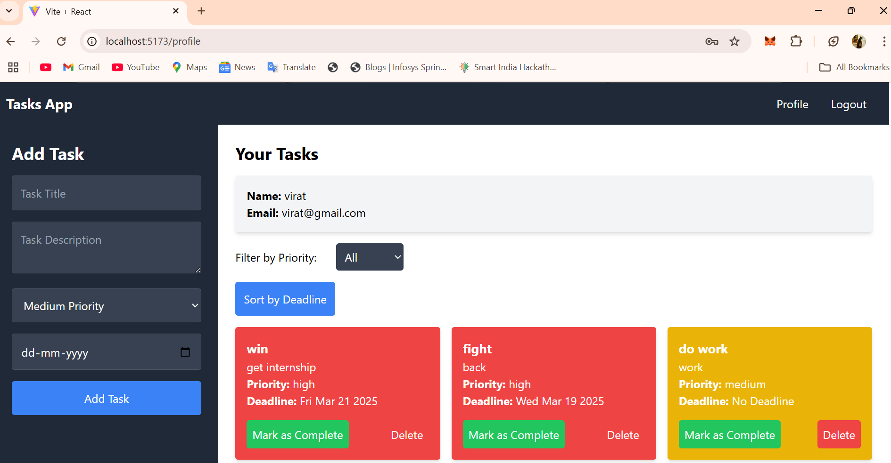
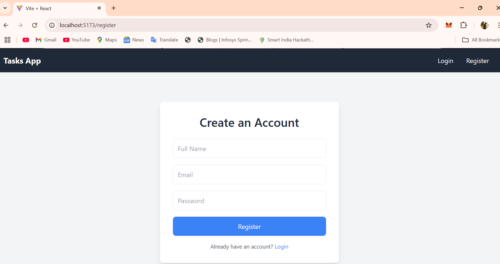
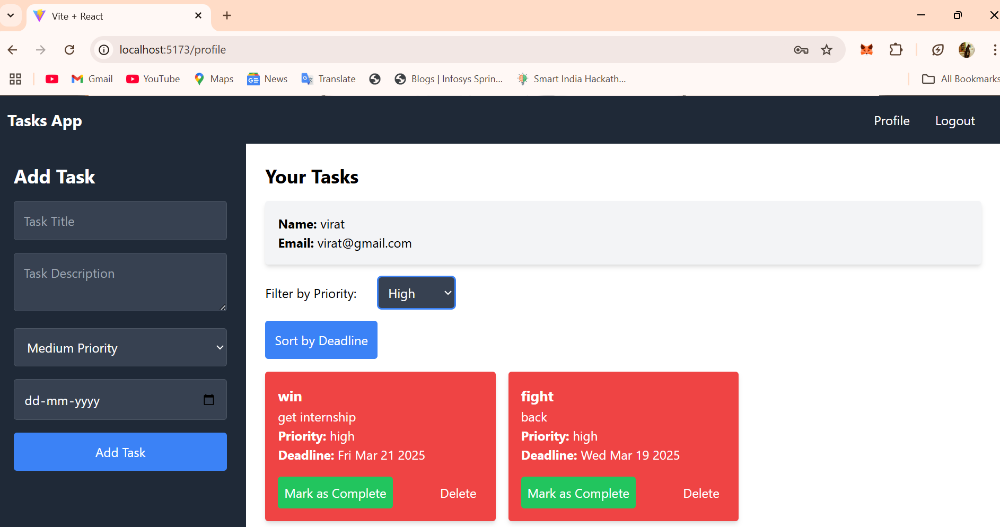

# 📝 Task Management Application  

**Task Management Application** built using the **MERN stack** (MongoDB, Express.js, React, Node.js) with **Redis caching** to enhance performance. This application allows users to **add, update, delete, and mark tasks as complete** while ensuring **fast data retrieval with Redis**.  

---
## 📸 Screenshots  

### 🏠 Login Page  
  

### 📋 Profile
  

### ✅ Register Page
  

### ✅ Redis
 

### ✅ Filter  
  

## 🚀 Tech Stack  

### **Backend**  
- **Node.js** - JavaScript runtime  
- **Express.js** - Web framework for Node.js  
- **MongoDB** - NoSQL database for storing tasks  
- **Mongoose** - ODM (Object Data Modeling) library for MongoDB  
- **Redis** - In-memory data store for caching tasks  
- **JWT (JSON Web Tokens)** - Secure authentication mechanism  

### **Frontend**  
- **React.js** - JavaScript library for building UI  
- **Redux Toolkit** - State management  
- **Tailwind CSS** - Modern, responsive styling  

---

## 🌟 Features  

✅ **User Authentication** (Signup, Login, Logout using JWT)  
✅ **Create, Read, Update, and Delete (CRUD) Tasks**  
✅ **Prioritize Tasks** (High, Medium, Low)  
✅ **Mark Tasks as Complete**  
✅ **Set Deadlines for Tasks**  
✅ **Redis Caching for Faster Performance**  
✅ **MongoDB as a NoSQL database**  
✅ **Secure API using JWT Authentication**  

---

## ⚡ Benefits  

✔️ **High Performance**: Redis caching speeds up task retrieval.  
✔️ **Scalability**: MongoDB ensures efficient handling of large datasets.  
✔️ **Data Persistence**: Tasks are stored in MongoDB even after the app restarts.  
✔️ **Security**: JWT authentication ensures secure user access.  
✔️ **User-Friendly**: Simple UI built with React.js for seamless task management.  

---

## 🛠️ Installation & Setup  

### 1️⃣ **Clone the Repository**  
```sh
git clone https://github.com/27SHIVAMSUYAL/TaskManagement.git
cd TaskManagement
```

### 2️⃣ **Backend Setup**  
```sh
cd backend
npm install
```
Create a `.env` file inside the `backend` folder and add the following environment variables:  
```env
MONGO_URI=your_mongodb_connection_string
JWT_SECRET=your_secret_key
REDIS_HOST=your_redis_host
REDIS_PORT=your_redis_port
```
Start the backend server:  
```sh
npm start
```
By default, the backend runs on **`http://localhost:5000`**.  

---

### 3️⃣ **Frontend Setup**  
```sh
cd ../frontend
npm install
npm start
```
The frontend will be available at **`http://localhost:3000`**. 🎉  

---

## 🔥 How It Works  

1. **User Registration & Login**  
   - Users must register and log in to manage tasks.  
   - JWT tokens are generated for authentication.  

2. **Task Management**  
   - Users can create tasks with a **title, description, priority, and deadline**.  
   - Tasks can be **updated, marked as complete, or deleted**.  
   - Data is stored in **MongoDB**.  

3. **Redis Caching**  
   - When a user fetches tasks, they are **cached in Redis**.  
   - If tasks are updated, the cache is cleared to ensure **fresh data**.  
   - This reduces database load and improves performance.  

---

## 🔥 API Endpoints  

| Method | Endpoint             | Description          |
|--------|----------------------|----------------------|
| POST   | `/api/auth/register` | Register User       |
| POST   | `/api/auth/login`    | Login User          |
| GET    | `/api/tasks`         | Get All Tasks       |
| POST   | `/api/tasks`         | Add Task            |
| PUT    | `/api/tasks/:id`     | Update Task         |
| DELETE | `/api/tasks/:id`     | Delete Task         |
| PATCH  | `/api/tasks/:id/complete` | Mark Task as Complete |

---

## 📸 Screenshots (Optional)  
_(Add screenshots of the UI to showcase the app)_  

---

## 🤝 Contributing  

Contributions are welcome! Follow these steps to contribute:  

1. Fork the repository  
2. Create a new branch (`git checkout -b feature-branch`)  
3. Commit changes (`git commit -m "Added new feature"`)  
4. Push to the branch (`git push origin feature-branch`)  
5. Open a Pull Request  

---

## 📜 License  

This project is **open-source** and available under the **MIT License**.  
